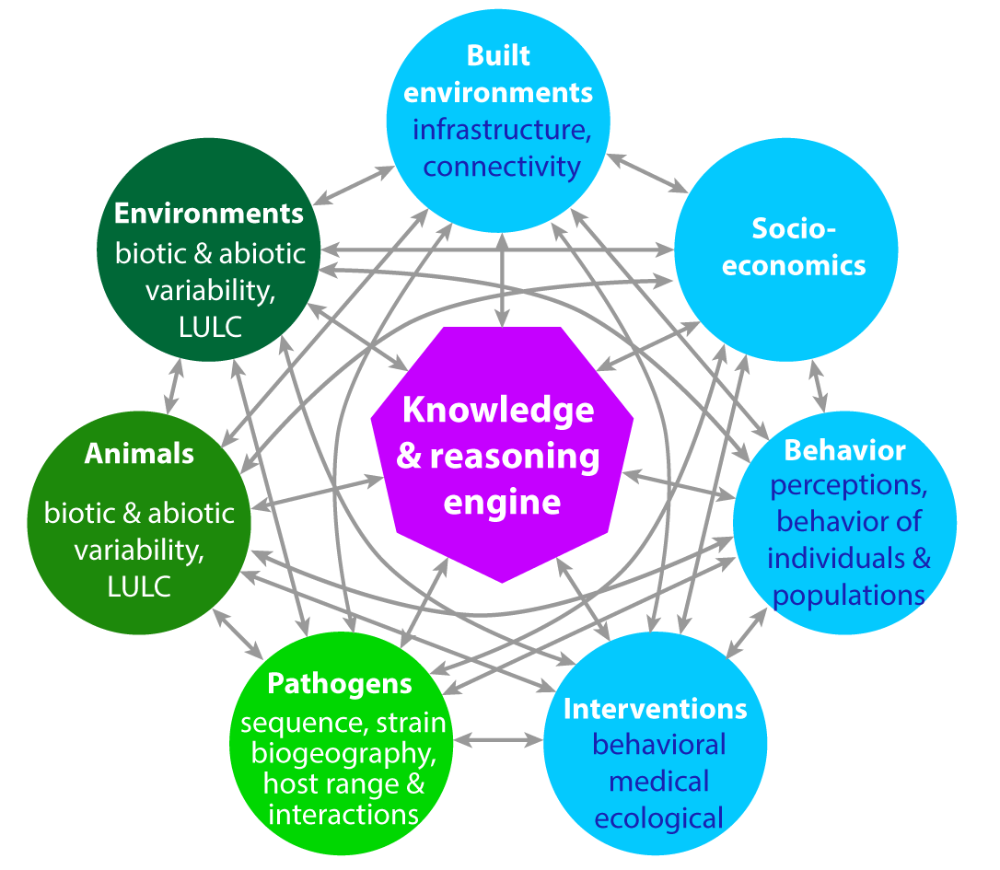
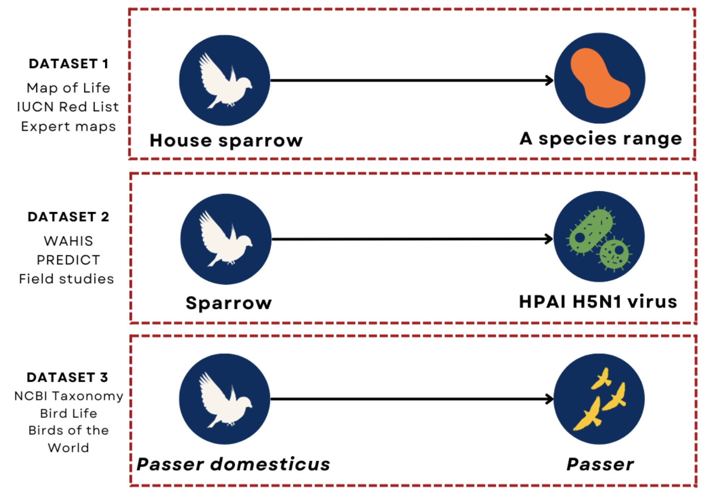
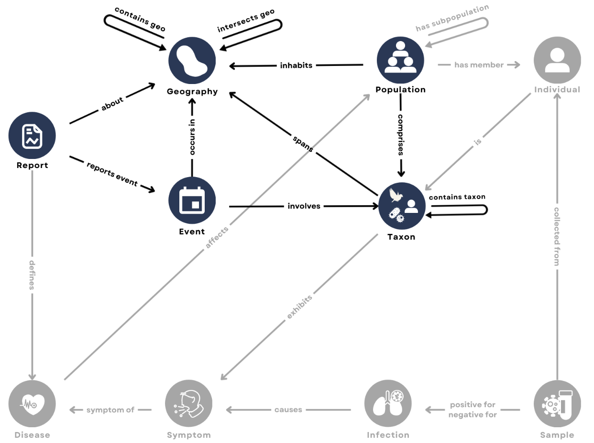

<!-- BANNER --> 
</div> <!-- container-fluid main-container -->
<div class="jumbotron homepagebanner jumbotron-fluid">
<div class="container">
## **Research --- HeMI : IDI**<br>Demonstration Project 1:<br>Advancing knowledge and reasoning in Artificial Intelligence to predict and understand zoonotic transmission and spillover {.lead .tagline}
</div> <!--end container-->
</div> <!--end jumbotron-->

<!-- MAIN CONTENT --> 
<div class="container-fluid main-container">

<!-- <p id="disclaimer"></p> -->

## Abstract

```{r fig1, echo=FALSE, out.width='30%', out.extra='style="float:left; padding:10px"', fig.cap=''}

```
Zoonotic diseases are impacted by multiple interconnected systems involving animals, humans, and the environment. The viral evolution and basis of transmission are often examined in isolation, without considering interactions between host behavior and ecology. This project aims to use artificial intelligence to enhance predictive intelligence by learning patterns from data to advance system reasoning (what will happen next and why?). 

This demonstration project will utilize existing knowledge about disease-specific systems and system relations to create a comprehensive framework of knowledge about Highly Pathegenic Avian Influenza (HPAI) across both human and non-human animals at a global scale. Additionally, this project expects to create and test an automated reasoning engine to fill in gaps in informational concerning HPAI.

## HPAI Knowledge Graphs

The growing occurrence of zoonotic disease outbreaks underscores the interconnectedness of animal and human networks. 

Researchers have developed numerous mechanistic, statistical, and machine learning models to capture the multifaceted and dynamic nature of zoonotic disease outbreaks systems from multiple disciplinary perspectives. However, bridging data and models across disciplines presents a significant challenge, in part due to the lack of interoperability between datasets. 

Knowledge graphs offer a powerful solution for reconciliation, integration, and synthesis of heterogeneous data. **We demonstrate the utility of a knowledge graph to integrate laboratory, field, and historical data about highly pathogenic avian influenza (HPAI) and generate new hypotheses upon which future disease mitigation will depend.**

Traditional data systems are not interoperable across sources (Fig 2). To make related heterogeneous datasets interoperable, we first define an ontology, represented as a graph of element types and relations among types (Fig 3). Source datasets can then be ingested into a knowledge graph with standardized elements and relations. 

```{r fig2, echo=FALSE, out.width='500px', out.extra='style="float:left; padding:10px"', fig.cap=''}

```

<small>
**Figure 2. Traditional data systems are not interoperable across sources.** The figure shows sample records from three source datasets. Each row shows the same species (*Passer domesticus*). Because the record id's are not standardized and the structure of the datasets are not the same, the datasets cannot easily be joined.
</small>

<br clear="all" />

```{r fig3, echo=FALSE, out.width='500px', out.extra='style="float:left; padding:10px"', fig.cap=''}

```

<small>
**Figure 3. A zoonotic disease ontology aligns data across domains based on shared elements for integration in a knowledge graph.** Ontologies are defined in terms of data types (nodes) and relations between data types (edges). The graph represents the zoonotic disease ontology we have developed for our knowledge graph. Blue nodes represents elements of that have already been ingested from source datasets; gray nodes represent elements from other datasets that have yet to be ingested. 
</small>

<br clear="all" />

The completed knowledge graph can then be queried


<!--
```{r echo=FALSE, out.extra='id="DP1" scrolling="no" width="100%"'}
insert_tag <- function(html,tag,before="</body>") {
  gsub(before,paste0(tag,"\n",before),html)
}

knitr::include_url("DP1_summary.html")
```
<script>iFrameResize({ log: false }, '#DP1')</script>
-->


## Supplemental Information

::: container-frames

<!--
<p>Preprint:<br>
  <a href="https://github.com/CEIDatUGA/covid-university-reopening/raw/master/manuscript.pdf" target="_blank">
  Demonstration Project 1:  Advancing knowledge and reasoning in Artificial Intelligence to predict and understand zoonotic transmission and spillover</a> (pdf)
</p>
-->

<p>**Poster:** Robertson, H., E. Graeden, A. Castellanos, D. Rosado, J.M. Drake, B. Han. "Knowledge Graphs for Scalable Data Integration: A Case Study of Highly Pathogenic Avian Influenza (HPAI)." *MIDAS Network Annual Meeting.* October 29-31, 2023. 
<a href="pdf/DP#1 - PIPP Phase I 2023 MIDAS Poster.pdf" target="_blank">(pdf) </a>
</p>

<!--
<p>
  <a href="https://github.com/CEIDatUGA/covid-university-reopening" target="_blank">
    
    GitHub repository (public)
  </a>
</p>
-->

:::

