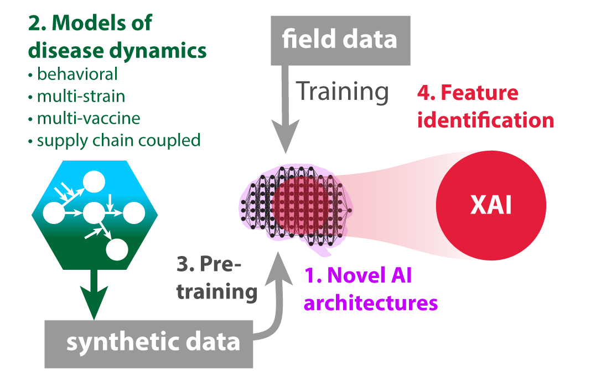

<!-- BANNER --> 
</div> <!-- container-fluid main-container -->
<div class="jumbotron homepagebanner jumbotron-fluid">
<div class="container">
## **Research --- HeMI : IDI**<br>Demonstration Project 2:<br>Explainable Artificial Intelligence (XAI) for pandemic preparedness {.lead .tagline}
</div> <!--end container-->
</div> <!--end jumbotron-->

<!-- MAIN CONTENT --> 
<div class="container-fluid main-container">

<!-- <p id="disclaimer"></p> -->

## Abstract

```{r fig1, echo=FALSE, out.width='30%', out.extra='style="float:left; padding:10px"', fig.cap=''}

```

This project aims to use explainable artificial intelligence (XAI) to help understand artificial intelligence outputs. XAI has the capability to assess which features of a model are most impactful on the outcome: such as general features, model inputs, temporal events, specific data subsets or a combination of these features. This can be a tool to understand which  features of transmission dynamics most affect model predictions. 

This project also will utilize compartmental models to examine the impact of vaccinations on disease dynamics in humans, while considering events such as vaccine development and virus mutations. Artificial intelligence algorithms can produce prediction results that may be difficult to understand and interpret and XAI detects relationships that can make these results more impactful.

<!---
```{r echo=FALSE, out.extra='id="DP2" scrolling="no" width="100%"'}
knitr::include_url("DP2_summary.html")
```
<script>iFrameResize({ log: false }, '#DP2')</script>
--->

<!--
## Supplemental Information

<div class="container-frames">

<p>Preprint:<br>
  <a href="https://github.com/CEIDatUGA/covid-university-reopening/raw/master/manuscript.pdf" target="_blank">
  Demonstration Project 2:  Explainable Artificial Intelligence (XAI) for pandemic preparedness</a> (pdf)
</p>

<p>
  <a href="https://github.com/CEIDatUGA/covid-university-reopening" target="_blank">
    
    GitHub repository (public)
  </a>
</p>

</div>
-->

