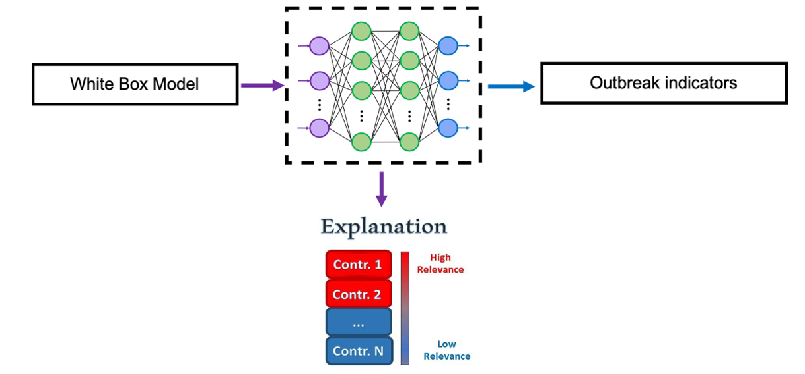

<!-- BANNER --> 
</div> <!-- container-fluid main-container -->
<div class="jumbotron homepagebanner jumbotron-fluid">
<div class="container">
## **Research --- HeMI : IDI**<br>Demonstration Project 2:<br>Explainable Artificial Intelligence (XAI) for pandemic preparedness {.lead .tagline}
</div> <!--end container-->
</div> <!--end jumbotron-->

<!-- MAIN CONTENT --> 
<div class="container-fluid main-container">

<!-- <p id="disclaimer"></p> -->

## Abstract

<div style="width:50%; min-width:300px; float:left; padding:10px">

<small>**Figure&nbsp;1. Conceptual overview of demonstration project.**</small>
</div>

This project aims to use explainable artificial intelligence (XAI) to help understand artificial intelligence outputs. XAI has the capability to assess which features of a model are most impactful on the outcome: such as general features, model inputs, temporal events, specific data subsets, or a combination of these features. This can be a tool to understand which features of transmission dynamics most affect model predictions. 

This project also will utilize compartmental models to examine the impact of vaccinations on disease dynamics in humans, while considering events such as vaccine development and virus mutations. Artificial intelligence algorithms can produce prediction results that may be difficult to understand and interpret and XAI detects relationships that can make these results more impactful.

<br clear="all" />

## Objectives

- Identifying the most important features that affect the outcome of an outbreak and efficient ways to contain the outbreak.  
-	Utilizing real-world data for fine-tuning the model parameters and examining the implications of incorporating this data into the model’s predictions and feature importance.  

## Approach

### Disease Transmission Model

<div style="width:50%; min-width:300px; float:left; padding:40px">

</div>

<small>**Figure&nbsp;2. Compartmental model for multi-strain disease transmission with vaccination.** The model is a modified $SEIR$ type model with Susteptible $S$, Latent $E$, Infectious $I$, and Removed $R$ classes, as well as Vaccinated $V$, Hospitalized $H$ and Deceased $D$ classes. The model allows susceptible individuals to be infected with or vaccinated against one of multiple strains $k$. Vaccinated individuals may still become infected with other strains. </small>

We developed a multi-strain, multi-vaccine model of disease dynamics to study the complex nonlinear dynamics of disease outbreaks. This model of transmission accounts for multiple viral strains, multiple vaccines, vaccine preferences, and vaccine-related variables such as the introduction date, lead time, and efficacy.

The goal is to model the complex nonlinear dynamics of disease outbreaks. This model is used as a baseline to simulate all possible scenarios during an outbreak and create a database to conduct analysis. 

<br clear="all" />

### Model Analysis with Explainable AI

<div style="width:50%; min-width:300px; float:left; padding:10px">

<br><br>
<small>**Figure&nbsp;3. Explainable AI for pandemic containment.** A white box model (compartmental transmission model) provides inputs to a neural network, which outputs outbreak indicators. Explainable AI (XAI) techniques are used to identify features with the greatest impact on outbreak indicators. Identified features could then be used as targets for intervention by decision makers.</small>
</div>

We trained a neural network algorithm on the synthetic data generated from the multi-strain-vaccine model. The proposed **model inputs** include population-based features including susceptible, infected, vaccinated, exposed, hospitalized, and recovered populations (see above compartmental model), as well as virus-related features for each variant like transmission rates, hospitalization rates, death rates, and vaccine efficacies. 
The **model outputs** of the network are the essential outbreak indicators within a defined period, crucial for our monitoring during a public health emergency. 

This network is then used to provide **human interpretability** for complex decision making using advanced explainable AI techniques. This approach detects the features that affect disease outcomes the most, with the goal of facilitating decision making aimed at pandemic containment. 


<!---
```{r echo=FALSE, out.extra='id="DP2" scrolling="no" width="100%"'}
knitr::include_url("DP2_summary.html")
```
<script>iFrameResize({ log: false }, '#DP2')</script>
--->


## Supplemental Information

<div class="container-frames">

<p>**Poster:** Kelly, S., A. Ghadami, J. M. Drake, B. I. Epureanu. "Unveiling Key Factors in Disease Transmission through Explainable AI." *MIDAS Network Annual Meeting.* October 29-31, 2023. 
<a href="pdf/MIDAS_2023_poster_Kelly.pdf" target="_blank">(pdf) </a>
</p>

<!--
<p>
  <a href="https://github.com/[repo]" target="_blank">
    
    GitHub repository (public)
  </a>
</p>
-->

</div>


