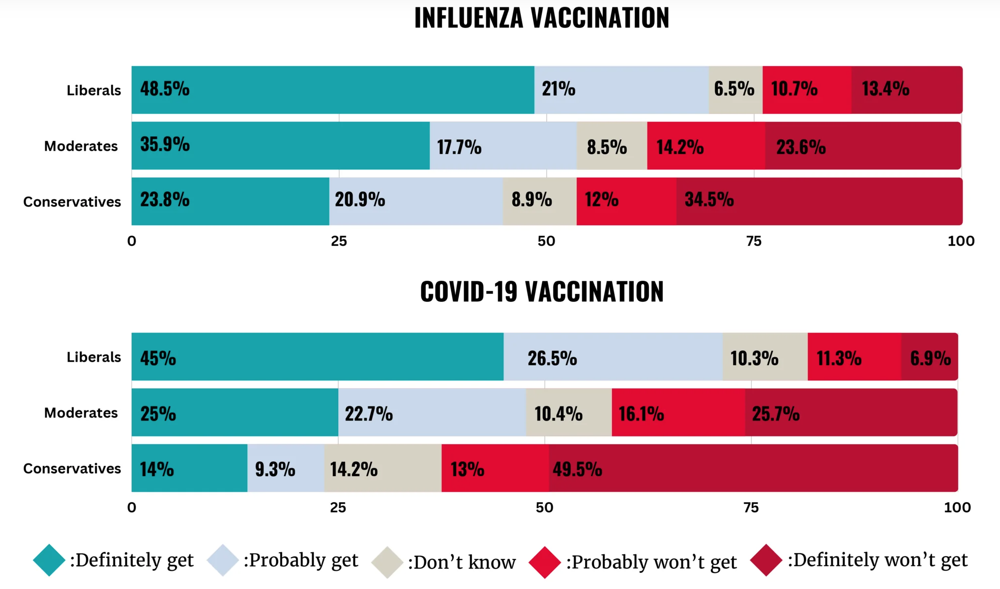

<!-- BANNER --> 
</div> <!-- container-fluid main-container -->
<div class="jumbotron homepagebanner jumbotron-fluid">
<div class="container">
## **Research --- HeMI : IDI**<br>Demonstration Project 3:<br>Integration of pandemic and infectious disease-related health and risk-benefit communication science and data into models {.lead .tagline}
</div> <!--end container-->
</div> <!--end jumbotron-->

<!-- MAIN CONTENT --> 
<div class="container-fluid main-container">

<!-- <p id="disclaimer"></p> -->

## Abstract

```{r teaser, echo=FALSE, out.width='30%', out.extra='style="float:left; padding:10px"', fig.cap=''}
knitr::include_graphics("images/PIPP_DP3.png")
```

To address communicable diseases, effective communication is essential when implementing preventative or response measures from a local to global scale. Understanding how demographics, political ideologies, race, ethnicity, and location impact human behaviors during outbreaks and pandemics is important. 

This project will analyze national datasets collected by the Grady College Center for Health & Risk Communication about influenza and COVID-19 to identify empirical patterns and provide insight on human health decision making and population characteristics related to respiratory illnesses. This analysis can identify relationships between factors such as vaccination status, health decision-making preferences, health-information seeking, political ideologies, and key demographics to inform forecasting and models to support decision making. 

## Survey of COVID-19 and Influenza Vaccination Intent 

We conducted a **national survey** of 1,280 adults to understand how intentions to receive vaccination for both COVID-19 and Influenza may be influenced by factors such as demographics and political ideology. 

The survey was administered by NORC at the University of Chicago ([norc.org](https://norc.org)) in August 2023, and measured intentions related to influenza and COVID-19 vaccinations. A **followup survey** in early 2024 will examine how intentions track with behaviors. 

**Previous surveys** conducted by Grady College of the University of Georgia in prior seasons provide a basis for comparing changes in intention and behavior over time, particularly with respect to influenza.


## Preliminary Findings

- Vaccination intentions were higher for liberal than conservative respondents.  
- More adults were likely to get a flu vaccine than an updated COVID-19 vaccine.  

**For Influenza:**

- 55\% of respondents reported they would "definitely" or "probably" get a recommended flu vaccine  
- 70\% of respondents who identify as liberal and 45\% of conservatives plan to get a recommended flu vaccine

**For COVID-19:**

- 46\% of respondents reported they would "definitely" or "probably" get an updated COVID-19 vaccine  
- 72\% of respondents who identify as liberal and 23\% of conservatives plan to get an updated COVID-19 vaccine

```{r fig1, echo=FALSE, out.width='700px', out.extra='style="float:left; padding:10px"', fig.cap=''}

```

<small>
**Figure 1. Vaccination intention by political ideology.** University of Georgia 2023 national survey of 1,280 adults. 
</small>

<br clear="all" />

Other variables correlated with influenza and COVID-19 vaccination intentions include 

- demographic factors (including age and race)  
- diagnosed illnesses, medical conditions  
- recommendation from health care professionals

The survey found a strong connection between perceived risk and likelihood to get both vaccines. Among those with a high perceived risk of being infected with influenza or COVID-19, approximately 81% and 78%, respectively, planned to get vaccinated.

## Next Steps

The results of the surveys of vaccination intention and behavior will help identify social and demographic
factors affecting policy acceptance. 

We are now exploring how to encode these insights into behavioral transmission models, either structurally or through parameterization, in order to study the interactions of transmission, behavior and policy in a real population.
Such a model may be used to suggest strategies for policy design and public
health messaging. Initial analyses suggest, for example, that a significant factor in controlling
the severity of an outbreak may be preventing a
compliant population from rejecting existing public
health guidelines and messages.


<!--
```{r echo=FALSE, out.extra='id="DP3" scrolling="no" width="100%"'}
knitr::include_url("DP3_summary.html")
```
<script>iFrameResize({ log: false }, '#DP3')</script>
-->


## Supplemental Information

<div class="container-frames">

<!-- <p>Preprint:<br>
  <a href="https://github.com/CEIDatUGA/covid-university-reopening/raw/master/manuscript.pdf" target="_blank">
  Demonstration Project 3:  Integration of pandemic and infectious disease-related health and risk-benefit communication science and data into models</a> (pdf)
</p>
-->

News item: Schroeder, Jackson. "More adults likely to get a flu vaccination than receive an updated COVID-19 vaccine."
October 02, 2023. *Grady College, University of Georgia.* <https://grady.uga.edu/news/more-adults-likely-to-get-a-flu-vaccination-than-receive-an-updated-covid-19-vaccine/>

<p>
  <a href="https://github.com/PandemicSystems/DP3-survey" target="_blank">
    
    GitHub repository (private)
  </a>
</p>

</div>
