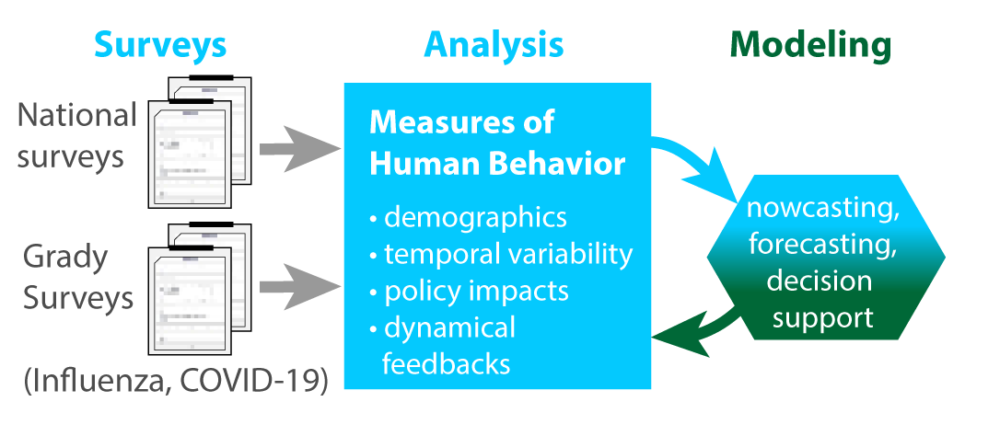

<!-- BANNER --> 
</div> <!-- container-fluid main-container -->
<div class="jumbotron homepagebanner jumbotron-fluid">
<div class="container">
## **Research --- HeMI : IDI**<br>Demonstration Project 3:<br>Integration of pandemic and infectious disease-related health and risk-benefit communication science and data into models {.lead .tagline}
</div> <!--end container-->
</div> <!--end jumbotron-->

<!-- MAIN CONTENT --> 
<div class="container-fluid main-container">

<!-- <p id="disclaimer"></p> -->

## Abstract

```{r fig1, echo=FALSE, out.width='30%', out.extra='style="float:left; padding:10px"', fig.cap=''}

```

To address communicable diseases, effective communication is essential when implementing preventative or response measures from a local to global scale. Understanding how demographics, political ideologies, race, ethnicity, and location impact human behaviors during outbreaks and pandemics is important. 

This project will analyze national datasets collected by the Grady College Center for Health & Risk Communication about influenza and COVID-19 to identify empirical patterns and provide insight on human health decision making and population characteristics related to respiratory illnesses. This analysis can identify relationships between factors such as vaccination status, health decision-making preferences, health-information seeking, political ideologies, and key demographics to inform forecasting and models to support decision making. 

<!--
```{r echo=FALSE, out.extra='id="DP3" scrolling="no" width="100%"'}
knitr::include_url("DP3_summary.html")
```
<script>iFrameResize({ log: false }, '#DP3')</script>
-->

<!--
## Supplemental Information

<div class="container-frames">

<p>Preprint:<br>
  <a href="https://github.com/CEIDatUGA/covid-university-reopening/raw/master/manuscript.pdf" target="_blank">
  Demonstration Project 3:  Integration of pandemic and infectious disease-related health and risk-benefit communication science and data into models</a> (pdf)
</p>

<p>
  <a href="https://github.com/CEIDatUGA/covid-university-reopening" target="_blank">
    
    GitHub repository (public)
  </a>
</p>

</div>
-->