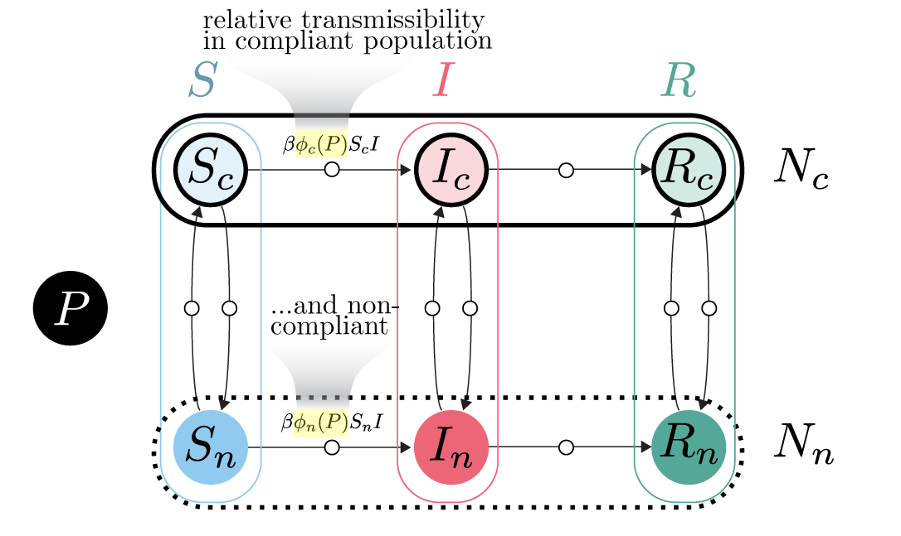

<!-- BANNER --> 
</div> <!-- container-fluid main-container -->
<div class="jumbotron homepagebanner jumbotron-fluid">
<div class="container">
## **Research --- HeMI : IDI**<br>Demonstration Project 4:<br>Social tipping points in infectious disease transmission {.lead .tagline}
</div> <!--end container-->
</div> <!--end jumbotron-->

<!-- MAIN CONTENT --> 
<div class="container-fluid main-container">

<!-- <p id="disclaimer"></p> -->

## Abstract

```{r fig1, echo=FALSE, out.width='30%', out.extra='style="float:left; padding:10px"', fig.cap=''}

```
The COVID-19 pandemic highlighted how the decisions of individuals regarding vaccination and mask-wearing were highly politicized and influenced by the messaging of visible spokespersons. This project focuses on developing a transmission model to classify individuals as either compliant or non-compliant with policies such as shelter-in-place, mask-wearing, or vaccination to explore long-term dynamics and identify “social tipping points” in infectious disease transmission. 

"Social tipping points" are conditions under which a combination of interventions, including public messaging, may lead to either rapid containment or a major outbreak. This model assumes that individuals are either Susceptible (S), Infectious (I), or Recovered and immune (R)  to illness. This model also considers a variable determining the severity of the policy. For example, lockdowns are more severe than gathering bans which are more severe than mask-wearing mandates. 

<!--
```{r echo=FALSE, out.extra='id="DP4" scrolling="no" width="100%"'}
knitr::include_url("DP4_summary.html")
```
<script>iFrameResize({ log: false }, '#DP4')</script>
-->

## Supplemental Information


<div class="container-frames">

<!--
<p>Preprint:<br>
  <a href="https://github.com/CEIDatUGA/covid-university-reopening/raw/master/manuscript.pdf" target="_blank">
  Demonstration Project 4: Social tipping points in infectious disease transmission</a> (pdf)
</p>
-->

<p>**Poster:** Sarkar, S., P. Rohani, J.M. Drake. "Theory of behavior-induced tipping points in the transmission of infectious diseases." *MIDAS Network Annual Meeting.* October 29-31, 2023. 
<a href="pdf/MIDAS_2023_poster_Sarkar.pdf" target="_blank">(pdf) </a>
</p>

<p>
  <a href="https://github.com/cimidi/sarkar-social-tipping-points" target="_blank">
    
    GitHub repository (private)
  </a>
</p>

</div>

