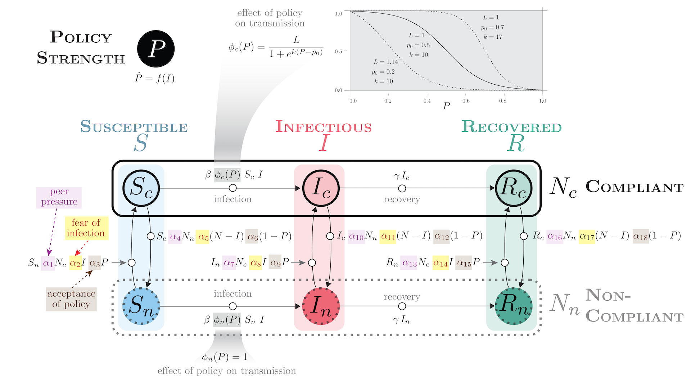
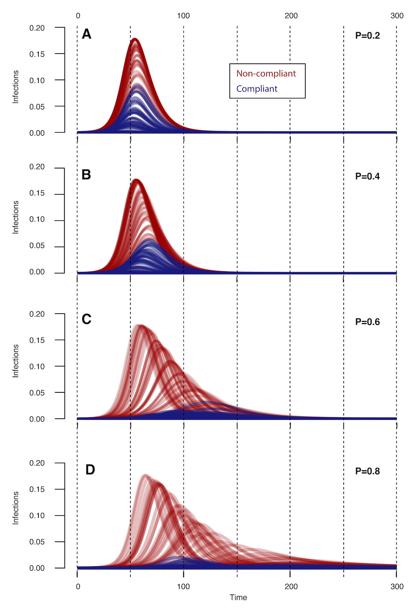
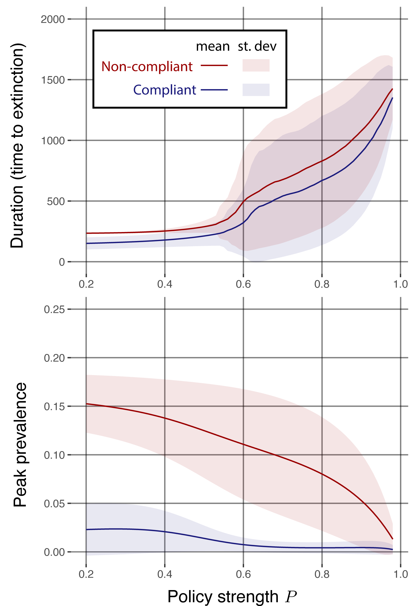

<!-- BANNER --> 
</div> <!-- container-fluid main-container -->
<div class="jumbotron homepagebanner jumbotron-fluid">
<div class="container">
## **Research --- HeMI : IDI**<br>Demonstration Project 4:<br>Social tipping points in infectious disease transmission {.lead .tagline}
</div> <!--end container-->
</div> <!--end jumbotron-->

<!-- MAIN CONTENT --> 
<div class="container-fluid main-container">

<!-- <p id="disclaimer"></p> -->

## Abstract

The COVID-19 pandemic highlighted how the decisions of individuals regarding vaccination and mask-wearing were highly politicized and influenced by the messaging of visible spokespersons. This project aims to develop a transmission model incorporating feedbacks among infection dynamics, behavior, and policy to explore long-term dynamics and identify *social tipping points* in infectious disease transmission wherein small changes in behavior or policy intervention strength can lead to qualitative changes in transmission leading to either rapid containment or a major outbreak.

<div style="width:70%; min-width:400px; float:left; padding:10px">

<p class="caption">
**Figure 1. Transmission model with policy and behavior.**
</p>
</div>

During outbreaks, various non-pharmaceutical interventions (NPIs) such as mask-wearing and social distancing may be effective in reducing the spread of infectious diseases, but not all members of a population may comply with public policies [^Ferguson][^Eikenberry]

[^Ferguson]: Ferguson NM, Laydon D, Nedjati-Gilani G, Imai N, Ainslie K, Baguelin M, Bhatia S, Boonyasiri A, Cucunubá Z, Cuomo-Dannenburg G, et al (2020). Impact of non-pharmaceutical interventions (npis) to reduce covid-19 mortality and healthcare demand. *Imperial College COVID-19 Response Team* 20(10.25561):77,482

[^Eikenberry]: Eikenberry SE, Mancuso M, Iboi E, Phan T, Eikenberry K, Kuang Y, Kostelich E, Gumel AB (2020). To mask or not to mask: Modeling the potential for face mask use by the general public to curtail the covid-19 pandemic. *Infectious disease modelling* 5:293–308

Therefore, the coupling between changing behaviors and disease dynamics may be important for anticipating the effectiveness of public policies. We developed a compartmental model to understand the contemporaneous spread of disease within a population comprising compliant and non-compliant groups.

## Model Features

We developed a compartmental model (Fig. 1) with the following characteristics:

- SIR model with compliant and non-compliant subpopulations. 
- Policy strength $0 < P < 1$, assumed to be a function of $I$. 
- Sigmoid effect of policy intervention strength on transmission in compliant populations $\phi_c(P)$, modeled as with fittable parameters logistic function with fittable parameters $L$ (leastupperbound), $k$ (logisticgrowthrate), and $p_0$ (value of midpoint). Policy is assumed to have no effect on transmission in non-compliant populations, i.e. $\phi_n(P) = 1$. Alternate functional forms are possible.   
- Behavioral mechanisms (peer pressure, fear of infection, acceptance of policy) modeled as parameters  $0 < \mathbf{\alpha} < 1$ mediating flow between compliant and non-compliant populations.  
- Architecture allows for feebacks among policy strength, behavior, and infection dynamics.  

## Preliminary Results

We examined the effect of policy strength on infection dynamics, using fixed policy $P$,
fixed parameters of $\phi_c(P)$ and Latin hypercube sampling of epidemiological and behavioral parameters (Fig. 2). We also studied the effect of policy strength on peak prevalence and time to extinction, indicators of infectiousness and disease persistence, respectively [^Allen][^Barbour].

[^Allen]: Allen LJ (2008). An introduction to stochastic epidemic models. *Mathematical epidemiology* pp. 81–130
[^Barbour]: Barbour, AD (1975). The duration of the closed stochastic epidemic. *Biometrika* 62(2):477–48253


<div style="width:50%; min-width:300px; float:left; padding:10px">

<div class="caption">
**Figure 2. Time evolution of disease dynamics for various policy strengths.** Policy strength has a significant impact on timing and duration of disease outbreaks. 

Initial conditions are:  
$S_c = 0.4999$, $I_c = 0.0001$, $R_c=0$,  
$S_n=0.4999$, $I_n=0.0001$,$R_n=0$. 

Parameters of $\phi_c(P)$ are:  
$L=1$,$k=10$, and $p_0 =0.5$. 

All other parameters are taken from the Latin hypercube sampling with $n = 500$.
</div>
</div>

<div style="width:50%; min-width:300px; float:left; padding:10px">

<div class="caption">
**Figure 3. Disease persistence (time to extinction) and peak prevalence as functions of policy strength $P$.** As modeled, policy strength above a threshold has a significant and non- linear impact on disease persistence (time to extinction) and peak prevalence.

Solid lines are the mean values over 1000 simulations using Latin hypercube sampling of parameters. Bands represent the standard deviation across simulations.

The results are consistent with the concept of "flattening the curve" that entered the popular lexicon during the COVID-19 pandemic (i.e., that interventions reduce peak prevalence at the cost of extending the outbreak in time.
</div>
</div>

<br clear="all" />

## Conclusions
- Non-pharmaceutical interventions can have a significant effect on the timing and severity of disease outbreaks in populations with varying proportions of compliant and non-compliant individuals. Effects may be non-linear.
- Peer pressure, fear of infection, and degree of compliance can have a significant impact on disease dynamics, especially in the subpopulation of compliant, susceptible individuals.
- Policies aimed at preventing initially compliant (and susceptible) individuals from rejecting interventions may be most effective at reducing the impact of disease outbreaks.

## Next Steps
- Implement and study feedback between infection level and policy strength.
- Determine how to fit the model to empirical epidemiological, behavioral, and policy data.

<!--
```{r echo=FALSE, out.extra='id="DP4" scrolling="no" width="100%"'}
knitr::include_url("DP4_summary.html")
```
<script>iFrameResize({ log: false }, '#DP4')</script>
-->

## Supplemental Information


<div class="container-frames">

<!--
<p>Preprint:<br>
  <a href="https://github.com/CEIDatUGA/covid-university-reopening/raw/master/manuscript.pdf" target="_blank">
  Demonstration Project 4: Social tipping points in infectious disease transmission</a> (pdf)
</p>
-->

<p>**Poster:** Sarkar, S., P. Rohani, J.M. Drake. "Theory of behavior-induced tipping points in the transmission of infectious diseases." *MIDAS Network Annual Meeting.* October 29-31, 2023. 
<a href="pdf/MIDAS_2023_poster_Sarkar.pdf" target="_blank">(pdf) </a>
</p>

<p>
  <a href="https://github.com/cimidi/sarkar-social-tipping-points" target="_blank">
    
    GitHub repository (private)
  </a>
</p>

</div>

