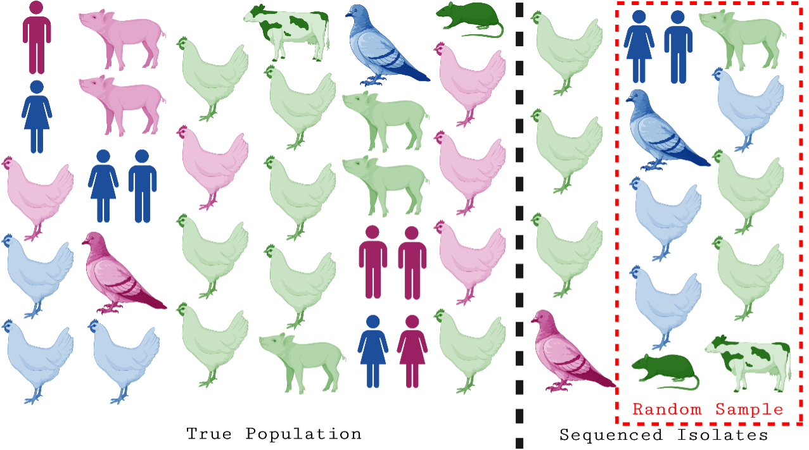

<!-- BANNER --> 
</div> <!-- container-fluid main-container -->
<div class="jumbotron homepagebanner jumbotron-fluid">
<div class="container">
## **Research --- HeMI : IDI**<br>Demonstration Project 5:<br>Competition dynamics, spread and diversity of co-circulating avian influenza A viruses with pandemic potential in wild and domestic hosts {.lead .tagline}
</div> <!--end container-->
</div> <!--end jumbotron-->

<!-- MAIN CONTENT --> 
<div class="container-fluid main-container">

<!-- <p id="disclaimer"></p> -->

## Abstract


<div style="width:50%; min-width:300px; float:left; padding:10px">

<small>**Figure&nbsp;1. Conceptual overview of demonstration project.**</small>
</div>

The influenza A virus has the ability to infect a variety of species. Though transmission between species is limited, it can lead to human pandemics and panzootics among domestic animals. It is difficult to prepare for these spillover events due to a lack of knowledge of viral traits that impact human transmission and limitations in quantifying the risk of exposure to reservoir populations. The goal of DP5 is to generate new knowledge about the underlying processes impacting influenza A virus spread, transmission potential, and adaptation. This project involves creating an integrated framework to examine the collective role of epidemiological, immunological, and evolutionary processes in shaping viral phylogenies.

<br clear="all" />

## Subsampling Strategy

The development of novel sequencing technologies has recently led to the rapid proliferation of large, readily available sequence datasets. While beneficial, it has led to new challenges for our traditional phylodynamic analysis pipelines. While some efforts have focused on developing heuristics to speed up computation times by reducing the complexity of analyses, Bayesian phylodynamic approaches often still require subsampling at the scale we see today. While some tools for subsampling have been developed in recent years to address this problem, many still need to offer features to ensure a balanced and well-spread sample. This can lead to erroneous results when it isn’t considered, as shown in the figure below, which shows a biased sampling process.

<div style="width:50%; min-width:300px; float:left; padding:40px">

<br><br>
<small>**Figure&nbsp;2. Subsampling strategy.**</small>
</div>

We are working to develop and systematically test new strategies for subsampling that will enable greater confidence in our estimates of epidemiologic parameters and help us better describe the history of an outbreak using sequence data. We have developed a novel subsampling tool, the *Phylogenetic Analysis Subsampling Tool (PAST)*, which allows us to generate a balanced and well-spread sample across many variables. To establish the veracity of our approach, we have built a Nextflow pipeline and simulation framework to test multiple subsampling strategies and analyze their impact. After concluding this investigation, we will be able to make definitive recommendations for subsampling strategy by using the phylodynamic research question.

<br clear="all" />

## Avian Influenza Phylodynamics

In the next phase of this work, we will leverage the subsampling strategy as input for our phylodynamic analysis of the recent H5 outbreak in North America. 

We will combine live animal trade flow and wild bird migratory pattern data to investigate the likely origins and independent introductions of avian influenza into North America during the recent outbreak of H5. We will also use Bayesian phylogenetic methods to investigate the changing host dynamics of H5, which has been identified on many occasions in mammals. This work may highlight gaps in our efforts to prevent spillover and highlight risk factors for future spillover events. 


<!--
```{r echo=FALSE, out.extra='id="DP5" scrolling="no" width="100%"'}
knitr::include_url("DP5_summary.html")
```
<script>iFrameResize({ log: false }, '#DP5')</script>
-->

<!--
## Supplemental Information

<div class="container-frames">

<p>Preprint:<br>
  <a href="https://github.com/CEIDatUGA/covid-university-reopening/raw/master/manuscript.pdf" target="_blank">
  Demonstration Project 5: Competition dynamics, spread and diversity of co-circulating avian influenza A viruses with pandemic potential in wild and domestic hosts</a> (pdf)
</p>

<p>
  <a href="https://github.com/CEIDatUGA/covid-university-reopening" target="_blank">
    
    GitHub repository (public)
  </a>
</p>

</div>
-->