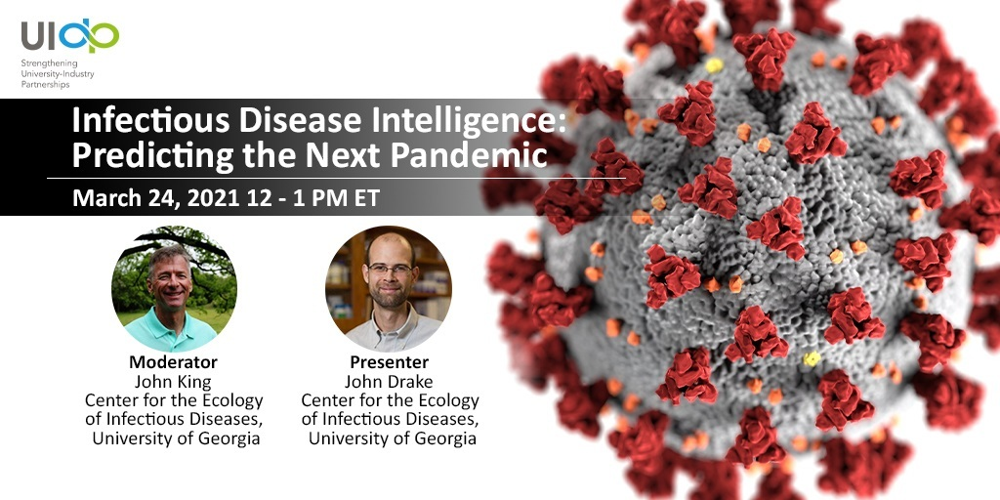

</div>

<!-- container-fluid main-container -->

<div class="jumbotron homepagebanner jumbotron-fluid">

<div class="container">

<!--<h1 class="display-3"></h1>-->

<h2 class="lead">

Heterogeneous Model Integration for Infectious Disease Intelligence

</h2>

<h4 class="lead">

A multi-disciplinary, multi-institutional project seeking to apply the engineering System-of-Systems (SoS) concept to the problem of integrating models across disciplinary paradigms and scales.
</h3>

<a class="btn btn-primary btn-sm" href="#news" role="button">News & Updates</a>

</h2>
</p>

</div>

</div>

<hr>

<div class="container-fluid main-container" id="updates">

<!-- container-fluid main-container -->

<!---
```{=html}

```
--->
<p>
Project Summary

Heterogeneous Model Integration for Infectious Disease Intelligence
A multi-disciplinary, multi-institutional project seeking to apply the engineering System-of-Systems (SoS) concept to the grand challenge of integrating models across disciplines and scales. This project introduces a new paradigm (SoS) for infectious disease modeling. 

This project is funded by a NSF Predictive Intelligence for Pandemic Prevention Phase I Development Grant (PIPP Phase I). Our Phase I activities will culminate in the development of a “Vision Paper” outlining the SoS approach to infectious disease model integration and providing a blueprint for a Phase II. We are conducting six interdisciplinary demonstration projects focusing on Highly Pathogenic Avian Influenza (HPAI) and applying SoS thinking to problems at the intersections of biology (BIO), computer science (CISE), social science (SBE), and engineering (ENG).

During Phase I, we are engaging in workforce enhancement through the training of undergraduates, graduate students, and postdoctoral associates. Broader impacts of our project include the development of innovative and translational modeling approaches with relevance to various US mission agencies (e.g. USDA, EPA, NIH, and CDC) and global organizations (e.g. WHO, FAO, OIE, UN), as well as the creation of extensible, open-access computer code and data pipelines for integrative infectious disease modeling.

We are currently forming an advisory board of leaders from academic, industry, government and non-governmental sectors, and building a network of stakeholders in advance of Phase II.


</p>


<div class="container-fluid main-container" id="updates">
::: card-header
### Latest Updates
:::

<!--NEWS ITEM-->

::: card
::: card-body
::: card-title

:::

<p class="card-text">

<small class="card-subtitle mb-2 text-muted">day MMM YYY</small><br> xxxxxxxxx

</p>
<!--to get the text from the rmarkdown displayed in html-->
```{r,setup,echo=FALSE,include=TRUE, results="asis"}

cat(htmltools::includeMarkdown("hey.md"))


```
<!-- <div class="card-link"> -->

<!-- [READ MORE &rarr;](news.html#) -->

</div>
:::
:::


<!--- to remove the border of the box while creating the block--->
<style>
    pre {
        border: 0;
    }
</style>
