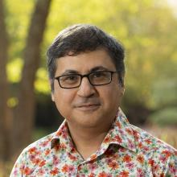

:::: {#contributors .jumbotron .jumbotron-fluid .homepagebanner}
::: container
## PANDEMIC SYSTEMS GROUP **People** {.lead}
:::
::::

::: card-body
# Project Council
:::

::: card-body

## John Drake (Principal Investigator)

John Drake is Regents Professor in the Odum School of Ecology and Director of the Center for the Ecology of Infectious Diseases (CEID) at the University of Georgia. He also directs the Global Infectious Disease Intelligence Consortium (GIDIC). Drake is a leading expert in modelling the dynamics of biological populations and epidemics, and has studied the emergence and spread of  numerous infectious diseases, including White-nose syndrome in North America, Ebola in Africa, and SARS-CoV-2 globally.

<a class="toggle-text-button">Read more</a>

Drake is working to advance the field of Infectious Disease Intelligence by developing the infrastructure and expertise to provide decision makers with timely, actionable information on disease risk, emergence, and spread. 

<a href="#" class="read-less" style="display:none;">Read less</a>

:::

::: card-body

## Justin Bahl

Justin Bahl is a Professor at the University of Georgia with a joint appointment in the College of Public Health (Department of Epidemiology & Biostatistics) and College of Veterinary Medicine (Department of Infectious Diseases). He is also a member of the Institute of Bioinformatics, the Center for the Ecology of Infectious Diseases, and the Center for Vaccines and Immunology at UGA. Bahl leads the Center for Applied Pathogen Epidemiology and Outbreak Response, a CDC Pathogen Genomics Center of Excellence (PGCoE).

<a class="toggle-text-button">Read more</a>

Bahl holds a PhD in Molecular Systematics and Evolution from the University of Hong Kong.  
With Hong Kong as the epicenter of the 2003 SARS-CoV global epidemic, Bahl changed his research focus to ecology and evolution of infectious diseases.

After completing his PhD, Bahl joined the State Key Laboratory for Emerging Infectious Diseases as a postdoctoral fellow and researching viral ecology and evolution. The State Key Laboratory is a World Health Organization (WHO) reference laboratory for the diagnosis of influenza A/H5, and a NIAID Center for Excellence for Influenza Research and Surveillance. 

He later joined Duke-NUS Graduate Medical School in Singapore, first as a postdoctoral associate in Molecular Epidemiology, then as Assistant Professor, then moved to the University of Texas School of Public Health in Houston as an Associate Professor before joining the University of Georgia. Bahl's training in evolutionary biology, epidemiology and ecology has equipped him for a research career focused on infectious disease dynamics.

<a href="#" class="read-less" style="display:none;">Read less</a>

:::

::: card-body

## Bogdan Epureanu

Bogdan I. Epureanu is an Arthur F. Thurnau Professor in the Department of Mechanical Engineering at the University of Michigan and has a courtesy appointment in Electrical Engineering and Computer Science. He is the Director of the Automotive Research Center (ARC), a $50 million center for innovating cutting-edge technologies that serve the next generation of ground transportation systems. The ARC is the flagship academic partner of the U.S. Army Ground Vehicle Systems Center, and at the heart of an ecosystem of research and education.

<a class="toggle-text-button">Read more</a>

His research focuses on nonlinear dynamics of complex systems, such as teaming of autonomous vehicles, enhanced aircraft safety and performance, early detection of neurodegenerative diseases, and forecasting tipping points in disease epidemics and ecology. His research brings together interdisciplinary teams and consortia such as Government (NIH, NSF, DOE, DOD), Industry (Ford, Pratt & Whitney, GE, Airbus), and Academia. He has published over 350 articles in journals, conferences, and books. He received his PhD from Duke University in 1999. 

<a href="#" class="read-less" style="display:none;">Read less</a>

:::

::: card-body

## Barbara Han

Dr. Barbara Han is a disease ecologist at the Cary Institute of Ecosystem Studies (NY). Her research program at the Cary Institute uses machine learning, deep learning, ecoinformatics, and dynamical modeling approaches with the goal to generate actionable predictions about infectious disease spillover and disease transmission in human and animal species.

<a class="toggle-text-button">Read more</a>

Han completed a PhD in Zoology at Oregon State University. During her PhD, she also spent a year as a Fulbright Fellow in Caracas, Venezuela. Dr. Han went on to complete consecutive postdoctoral fellowships in biological informatics (sponsored by NSF) and machine learning (sponsored by NIH) at the University of Georgia, Odum School of Ecology. 

<a href="#" class="read-less" style="display:none;">Read less</a>

:::

::: card-body

## Glen Nowak

Glen Nowak is Professor of Advertising and Co-Director of Center for Health and Risk Communication in the Grady College of Journalism and Mass Communication at the University of Georgia. Prior to joining the Grady faculty in January 2013, he worked for 14 years at the Centers for Disease Control and Prevention as Director of Media Relations and as communications director for CDC’s National Immunization Program. He has experience in managing and implementing health and risk communications programs, media relations, health information campaigns and social marketing. 

<a class="toggle-text-button">Read more</a>

Prior to joining CDC in January 1999, Nowak was an Associate Professor of Advertising and Communication in the Grady College of Journalism and Mass Communication. In this role, he taught undergraduate and graduate courses in principles of advertising, communication and advertising research, communication and advertising management, social marketing, and health communications. In the course of his career, Nowak has authored or co-authored a number of peer-reviewed journal articles on communications practices, social marketing, and health communications, and he has conducted numerous workshops and trainings on health communication, social marketing, risk communication and media relations. Nowak holds a PhD in Mass Communications from the University of Wisconsin-Madison. 

<a href="#" class="read-less" style="display:none;">Read less</a>

:::

::: card-body

## Pejman Rohani

Pejman Rohani is Regent’s Professor and Associate Dean for Academic Affairs in the Odum School of Ecology, University of Goergia. He also holds a joint appointment in the College of Veterinary Medicine (Department of Infectious Diseases). Rohani serves as Deputy Director of the Center for Influenza Disease and Emergence Research, an international consortium based at the University of Georgia that integrates human cohort studies with state-of-the-art fundamental research.

<a class="toggle-text-button">Read more</a>

Rohani’s research is focused on population biology, with emphasis on host-natural enemy interactions, with a view to understanding fundamental processes in ecology and evolution. He uses a combination of mathematical modeling, data analysis and statistical inference to understand the ecology and evolution of infectious diseases of humans and wildlife, including childhood infections and emerging infectious diseases. Rohani is co-author of *Modeling Infectious Diseases in Humans and Animals* (Princeton University Press, 2007). He holds a PhD from Imperial College, University of London.  

<a href="#" class="read-less" style="display:none;">Read less</a>

:::

::: card-body
# Senior Personnel
:::

::: card-body

## Michael Cacciatore

Michael Cacciatore is an Associate Professor of Public Relations Center for Health and Risk Communication in the Grady College of Journalism and Mass Communication at the University of Georgia.

<a class="toggle-text-button">Read more</a>

Cacciatore's research has examined the communication of science and risk topics ranging from nanotechnology to food safety to global climate change. A significant portion of this research has tracked media depictions of science and risk issues, paying particular attention to the role of social media in the communication process. His other research has focused most directly on the interplay between media, values, and risk in public opinion formation. His work has been published in Public Understanding of Science, Science Communication, Risk Analysis, New Media & Society, and Health Affairs among others. Cacciatore holds a PhD in Mass Communication from the University of Wisconsin-Madison. 

<a href="#" class="read-less" style="display:none;">Read less</a>

:::

::: card-body

## Amin Ghadami

Amin Ghadami is a Research Assistant Professor at the Sonny Astani Department of Civil and Environmental Engineering, University of Southern California. He received his PhD in Mechanical Engineering from the University of Michigan-Ann Arbor in 2019 and was a postdoctoral research fellow at the University of Michigan before joining the University of Southern California in 2023. He also earned his M.Sc. in Mechanical Engineering from Sharif University of Technology (2013) and B.Sc. in Mechanical Engineering from Isfahan University of Technology (2011).

<a class="toggle-text-button">Read more</a>

Ghadami's research interest focuses on developing data-driven and artificial intelligence techniques to predict, design, and control the dynamics of complex systems. The ultimate goal is to ensure the systems can best withstand undesirable and unexpected outcomes in their dynamics. These developments range from predicting catastrophic phenomena in the dynamics of natural and engineered systems to analysis and improving the resilience of multi-agent system dynamics while operating in uncertain environments. His research interests include dynamical systems and control, data-driven methods, and machine learning in dynamical systems.

<a href="#" class="read-less" style="display:none;">Read less</a>

:::

::: card-body

## Ellie Graeden

Ellie Graeden a Research Professor with the Georgetown University Center for Global Health Science and Security. Graeden spent the last decade establishing and leading a private company, Talus Analytics, designing and building data products to solve challenging problems at the intersection of policy, science, and strategy.

<a class="toggle-text-button">Read more</a>

Graeden now leads the health intelligence research pillar at the Center, including a team of data scientists, where she uses data architecture and engineering to address challenges in global data sharing. Graeden earned her undergraduate degree in microbiology from Oregon State University and her doctorate in biology from the Massachusetts Institute of Technology (MIT).

<a href="#" class="read-less" style="display:none;">Read less</a>

:::

::: card-body
# Other Personnel
:::

::: card-body

## Kerri-Ann Anderson (Postdoctoral Associate)

Kerri-Ann Anderson is a postdoctoral associate working with Dr. John Drake. Her past research utilized mathematical and computational models of cultural evolution to simulate the evolution of vaccine belief-behavior interactions. Using cultural evolutionary frameworks, she has examined the effects of individual- and population-level vaccination beliefs and behaviors as well as the effects of decision-making biases, changing social networks, and influencer strength on vaccine culture disease risk.

<a class="toggle-text-button">Read more</a>

Anderson's current goals as part of PIPP Phase 1 project team are to identify and assess survey measures that most inform health-related intentions, behaviors, and public support, and incorporate evolving health decision-making strategies into dynamical models of disease transmission and health-behavior adoption. Anderson holds a Master of Mathematical Sciences in Mathematical Biosciences from Ohio State University and a PhD in Biological Sciences (Cultural/Behavioral Evolution) from Vanderbilt University.  

<a href="#" class="read-less" style="display:none;">Read less</a>

:::

::: card-body

## Sakil Faizullah (PhD Student)

Sakil Faizullah worked for the BBC and the United Nations before coming to Grady College at the University of Georgia to pursue his PhD. Building on 23 years  working in the communications industry, Faizullah's current research focuses on finding communication tools that can help bring underprivileged population groups into a global conversation.

<a class="toggle-text-button">Read more</a>

Faizullah worked for the BBC World Service in Bangladesh as a producer for TV/radio, as well as for Radio Netherlands in Bangladesh, Nepal and Bhutan and the BBC Bengali Service in London. As Communication Manager for UNICEF Bangladesh, he designed and lead UNICEF Bangladesh's advocacy effort. Faizullah holds an MA in Radio and Radio Journalism from Goldsmith's, University of London. 

<a href="#" class="read-less" style="display:none;">Read less</a>

:::

::: card-body

## Ali Ghadami (PhD Student)

Ali Ghadami is currently pursuing a Ph.D. in the Mechanical Engineering Department at the University of Michigan, Ann Arbor. Prior to this, he earned an MSc degree in mechanical engineering from Sharif University of Technology, Iran, in 2023. His research focuses on machine learning and AI, dynamical systems control, and autonomous systems.

<a class="toggle-text-button">Read more</a>

Ghadami is currently working on applying explainable AI to analyze nonlinear dynamics of outbreaks. His work involves developing methods to identify key features within these systems that significantly influence disease outcomes and other objectives of interest.

<a href="#" class="read-less" style="display:none;">Read less</a>

:::

::: card-body

## Sean Kelly

Sean Kelly recently received his Ph.D. from the department of mechanical engineering at the University of Michigan working with Bogdan Epureanu. His research focuses on developing novel physics-informed data-driven reduced-order models for machinery, for predicting multi-harmonic forced response vibrations with friction nonlinearities, and estimating system parameters in operating conditions. 

<a class="toggle-text-button">Read more</a>

His work uses physics-informed concepts in conjunction with machine learning methods such as neural networks, which aim to maintain known system dynamics while also leveraging novel data-driven paradigms that allow for increased prediction speed, accuracy, and applicability to easily include experimental data. 

<a href="#" class="read-less" style="display:none;">Read less</a>

:::

::: card-body

## John King (Project Manager)

John King is Projects and Communications Manager with the Center for the Ecology of Infectious Diseases (CEID) and Global Infectious Disease Intelligence Consortium, Odum School of Ecology at the University of Georgia.  In these roles, John works with both internal and external customers to promote the CEID’s zoonotic research and infectious diseases modeling capabilities to help clients solve real-world challenges. 

<a class="toggle-text-button">Read more</a>

King recently co-organized the symposium *Japanese Encephalitis Virus: Emerging Global Threat to Humans and Livestock*, held at UGA in 2022. Presenters included veterinarians and researchers associated with the global pork industry. King lives with his wife on a reclaimed 36-acre farm outside of Athens, GA. He holds a B.S. in Zoology from the University of Georgia.

<a href="#" class="read-less" style="display:none;">Read less</a>

:::

::: card-body

## Éric Marty (Data Visualization)

Éric Marty is a Research Professional in the Center for the Ecology of Infectious Diseases (CEID) and Odum School of Ecology, University of Georgia, and Digital Arts Fellow with UGA's Willson Center for Humanities and Arts. Marty's research interests include data visualization, data sonification, and multi-modal data representation. He is concerned with optimizing data representation for exploration, analysis, and communication, and with high-dimensional and time-based data where standard visualization tools often fall short.

<a class="toggle-text-button">Read more</a>

Marty holds a PhD in Music Composition from the University of California at Berkeley, where he was a member of the Center for New Music and Audio Technologies, an interdisciplinary research center at the intersection of music, computer science and cognitive science. He has taught in art, music, graphic design and data visualization at the University of Georgia since 2003. Marty is an internationally recognized composer and sound artist.

<a href="#" class="read-less" style="display:none;">Read less</a>

:::

::: card-body

## Hailey Robertson (Data Research Analyst)

Hailey Robertson is a Data Research Analyst at the Data Lab in the Center for Global Health Science and Security, Georgetown University. As part of the Data Lab, Robertson works across projects at the intersection of infectious disease, health policy, and computing, with a focus on transforming complex data into actionable insights for decision-makers.

<a class="toggle-text-button">Read more</a>

Prior to joining the Center, Robertson worked as a data analyst at Talus Analytics, where she created data ontologies and employed them for analysis across multiple interacting systems, including the policy domain, human behavioral characteristics, and health security finance. Robertson also holds a fellowship with the International Justice Lab in the Global Research Institute at the William & Mary. Robertson graduated with honors from the University of Southern California in May 2021 with a B.S. in Global Health and a minor in Human Security and Geospatial Intelligence. 

<a href="#" class="read-less" style="display:none;">Read less</a>

:::

::: card-body

## Sukanta Sarkar (Postdoctoral Associate)

Sukanta Sarkar is a postdoctoral associate working with Dr. John Drake.  In this role, he is focused on mathematical modeling of living systems with theoretical descriptions of various biological phenomena.

<a class="toggle-text-button">Read more</a>

Sarkar has been studying consumer behavior using dynamical modeling of a real-world social contagion system and working to understand social tipping points in infectious disease transmission through dynamical systems. He is exploring whether statistical early warning signals are detectable in such systems and which perform most robustly. Sarkar holds a PhD in Mathematics from the Indian Institute of Technology, Ropar. 

<a href="#" class="read-less" style="display:none;">Read less</a>

:::

::: card-body

## Minsun Shim (MSc Student)

Minsun Shim is currently pursuing a Master's degree in Computer Science at the University of Southern California (USC), working with Amin Ghadami in the Data-Driven Dynamics Lab. Her primary research interest lies in solving challenging problems related to Network Security, Computer Networking, Machine Learning, and Dynamical Systems.

<a class="toggle-text-button">Read more</a>

Prior to joining USC, Shim completed a BE degree in Information Security (Cybersecurity) from Seoul Women's University. 

<a href="#" class="read-less" style="display:none;">Read less</a>

:::

::: card-body

## Tess Stevens (User Experience Designer)

Tess Stevens is a user experience designer at Talus Analytics focused on creating visuals that allow data to be thoughtfully investigated. Her work is informed by her interest in systems design, her background in writing and editing, and her commitment to clarity and functionality. 

<a class="toggle-text-button">Read more</a>

Stephens earned her MA in Strategic Communication Design from the University of Colorado Boulder and has an undergraduate degree in English from Northwestern University.

<a href="#" class="read-less" style="display:none;">Read less</a>

:::

::: card-body

## Guppy Stott (PhD Student)

Guppy Stott is a PhD student in the lab of Dr. Justin Bahl, College of Public Health at the University of Georgia.  Stott’s research focuses on SARS-CoV-2 and influenza phylogenetics. Stott studied mathematics at Clemson University and earned a master’s degree in statistics from North Carolina State University while working as a data scientist for TIAA.

<a class="toggle-text-button">Read more</a>

Stott spent a year at the CDC for an ORISE fellowship with the influenza division prior to starting their PhD in bioinformatics at UGA in 2021. Stott is representative for the Bioinformatics Graduate Student Association at the University of Georgia and editor-in-chief for the Athens Science Observer in Athens, GA. 

<a href="#" class="read-less" style="display:none;">Read less</a>

:::

::: card-body

## Madison Wilson (Administrator)

Madison Wilson is the Administrative Specialist for the Center for the Ecology of Infectious Diseases (CEID), Odum School of Ecology at the University of Georgia. In this role, she supports the CEID’s internal and external communications for scientific and public audiences; works with Odum School of Ecology faculty and staff to plan and execute teaching and research objectives; and manages and develops CEID budgets.   

<a class="toggle-text-button">Read more</a>

Madison is also managing PIPP Phase I project budget allocation with principal investigators and associates at the Cary Institute of Ecosystem Studies, Department of Mechanical Engineering at the University of Michigan, and various colleges and schools at the University of Georgia. Wilson holds an AB in Ecology from the Odum School of Ecology (University of Georgia) and an MS in Agricultural and Environmental Education from UGA's College of Agriculture, where she also earned a Certificate in Sustainability and a Certificate in Sustainable Food Systems. 

<a href="#" class="read-less" style="display:none;">Read less</a>

:::

::: card-body

## Ryan Zimmerman (Developer)

Ryan Zimmerman is a researcher and full stack developer, combining technical implementation skills with a BA in economics to build visualizations and user interactions which explore data in an actionable and accurate way while championing accessibility.

<a class="toggle-text-button">Read more</a>

Zimmerman has been a passionate storyteller and communicator across several types of media, including on-location photography and graphic design. At Talus, Zimmerman works to make sure the connections between the data, research, and story are as deeply connected to the final output as possible.

<a href="#" class="read-less" style="display:none;">Read less</a>

:::

<!--- to remove the border of the box while creating the block--->

