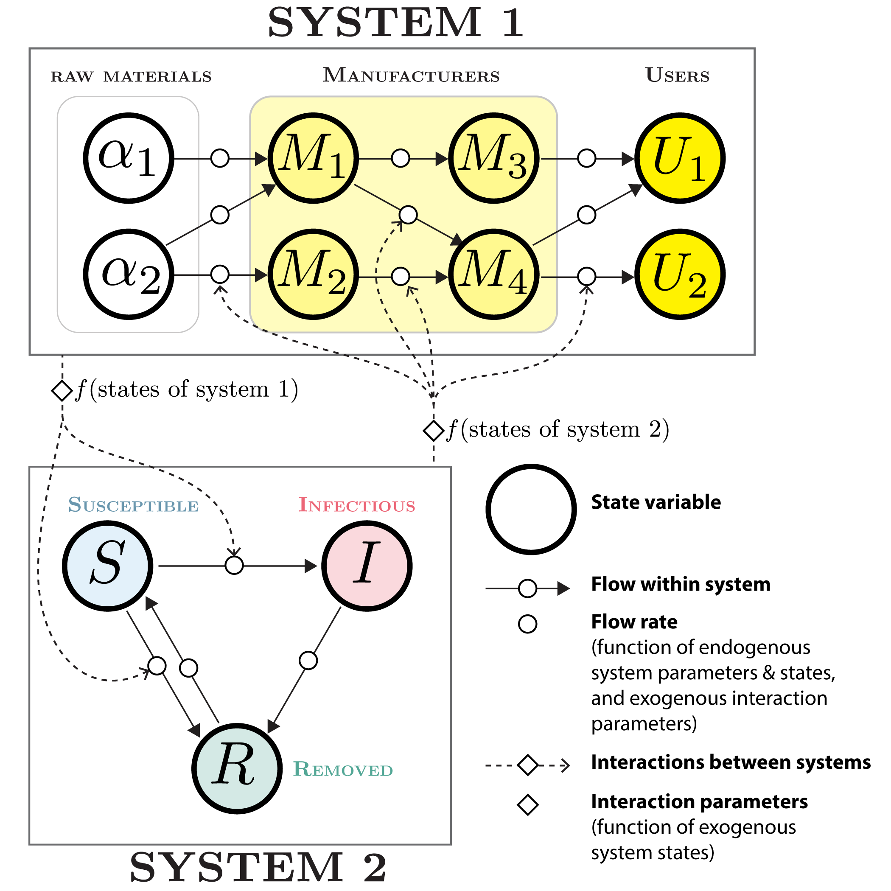

<!-- BANNER --> 
</div> <!-- container-fluid main-container -->
<div class="jumbotron homepagebanner jumbotron-fluid">
<div class="container">
## **Research**<br>Systems-of-Systems (SoS) for Infectious Disease Intelligence (IDI) {.lead .tagline}
</div> <!--end container-->
</div> <!--end jumbotron-->

<!-- MAIN CONTENT --> 
<div class="container-fluid main-container">

The COVID-19 pandemic demonstrated the interconnectedness of disease transmission, public health policy, human behavior, economics, supply chains, and numerous other systems normally considered in isolation. 

Each of these systems had been studied in depth, but feedbacks and interactions among these systems were poorly understood and negatively impacted the ability of society to respond to the pandemic. The models used to study these systems are highly heterogeneous, with distinct data and model structures that make them difficult to integrate directly.

Pandemic preparedness and response requires a robust infrastructure for **Infectious Disease Intelligence (IDI)** capable of integrating across a heterogeneous space of knowledge and models in order to provide interpretable, actionable intelligence to policy makers.

We propose to apply the **System-of-Systems (SoS)** paradigm, developed for complex engineering problems, to Infectious Disease Intelligence in order to advance outbreak preparedness and response during an infectious disease public health emergency.

### What is Infectious Disease Intelligence (IDI)?

Infectious disease intelligence refers to the systematic collection, analysis, and interpretation of data related to infectious diseases. It is an emerging practice that draws from multiple disciplines including epidemiology, virology, data science, public health, and social sciences to understand human behavior in the context of disease spread. IDI for pandemic preparedness and response seeks to provide actionable insights that can be used by stakeholders (government, healthcare providers, the general public, etc.) to make informed decisions that will help them prepare for and respond to pandemic threats.

Synthesizing information across the diverse component disciplines presents significant challenges, namely: 1) data variability, disparate analytical approaches, lack of common terminology and ontologies, lack of established collaboration platforms, and competing interest and objectives.

### What is a System-of-Systems (SoS) and how can it help meet the challenges of IDI?

A SoS is a system composed of constituent systems that are operationally independent (featuring self-contained dynamics, evolution and decision making), that nevertheless interact with each other via feedback mechanisms. For example, System A might be a compartmental model of disease transmission while System B is an economic model of supply chains, an interdependency studied in the context of COVID-19. 

```{r fig1, echo=FALSE, out.width='50%', out.extra='style="float:left; padding:10px"', fig.cap='_**Figure 1.** Conceptual diagram of a minimal System of Systems (SoS) with two constituent systems. Each system in a SoS is agnostic about the structure of systems exogenous to it. However, flows within the system are affected by a set of interaction parameters that are a function of the states of the exogenous system. In this example, System 1 is a model of a vaccine supply chain, and System 2 is a compartmental disease transmission model. System 2 may be affected by states of System 1 (e.g. vaccine inventory) via parameters reducing the flow from the Susceptible state to the Infectious state, and from Susceptible to Removed. In turn, System 1 may be affected by states of System 2 (e.g. disease prevalence) via parameters affecting rate of flow along the manufacturing chain (increased demand)._'}

```

<p style="clear:both"> <!-- to prevent this paragraph wrapping arround figure.-->
Adopting a SoS approach for pandemic intelligence offers several unique advantages over traditional methods of studying component systems in isolation of each other: 

1. a nuanced understanding of **interactions** and **emergent properties**;  
2. the ability to account for **more variables** than typically considered in isolated analyses;  
3. inherent **scalability**, allowing for multiple layers of complexity across diverse scales, and seamless integration of diverse systems;  
4. increased **flexibility**, **accessibility**, and **actionable value** to a wide range of stakeholders.

While in a singular system, control can be achieved through direct manipulation of its elements, this strategy often falls short when systems are interdependent. The SoS framework permits both direct and indirect control through manipulation of couplings between constituent systems, leading to more effective, nuanced interventions that can be tailored to specific needs and conditions. 

Our group is now developing the intellectual underpinnings of an operational System of Systems modeling approach for pandemic intelligence. This work includes establishing interdisciplinary ontologies, identifying feedbacks between constituent systems and expressing them functionally, building a pluralistic modeling toolkit for predicting phenomena from multiple assumptions and perspectives, and developing a data sharing infrastructure.


<!---</div>
```{r echo=FALSE, out.extra='id="system_of_systems" scrolling="no" width="100%"'}
knitr::include_url("system_of_systems_summary.html")
```
<script>iFrameResize({ log: false }, '#system_of_systems')</script>
--->

## Supplemental Information

::: container-frames

<p>Preprint:<br>
  <a href="https://docs.google.com/document/d/16K7Et8PaiaeyjJBJtL3-D1m9xV5EipHm4I_Mafxk3GY/edit?usp=sharing" target="_blank">
  Using systems-of-systems thinking to advance infectious disease intelligence for preparedness and response</a> (pdf)
</p>

<!--
<p>
  <a href="https://github.com/CEIDatUGA/covid-university-reopening" target="_blank">
    
    GitHub repository (public)
  </a>
</p>
-->

:::
